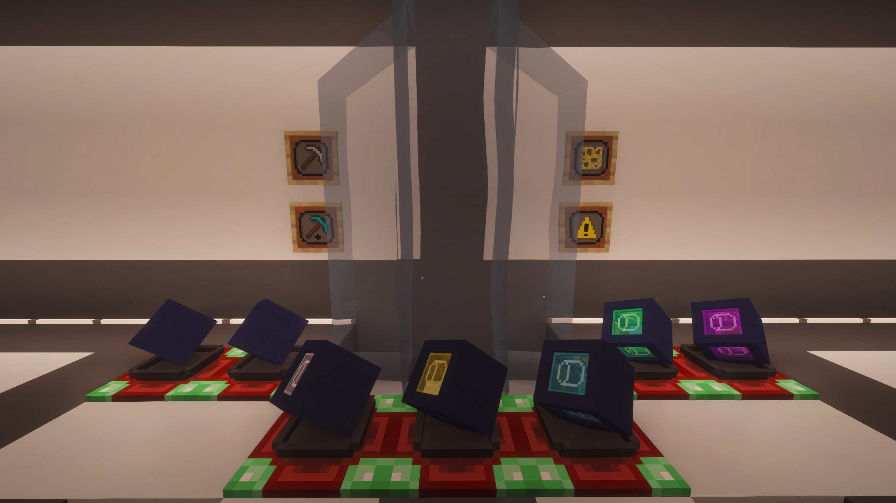

# DampNulls

DampNulls are the fluid-storage half of the mod. They store fluids by tank, can place and pick up source fluids in the world, and can interact with tanks and automation through the Docking Station or shift-right-click transfers.

## Core Capabilities

- Multi-tank fluid storage
- Source fluid placement and pickup
- Docking station fluid and chemical automation
- Shift-right-click transfer with compatible tanks
- Optional Mekanism chemical support through the Chemical Upgrade

## Tier Breakdown

| Tier | Tanks | Capacity Per Tank |
| --- | ---: | ---: |
| Redstone | 9 | 8,000 mB |
| Lapis | 9 | 16,000 mB |
| Iron | 9 | 32,000 mB |
| Gold | 18 | 64,000 mB |
| Diamond | 18 | 128,000 mB |
| Emerald | 18 | 256,000 mB |
| Creative | 18 | Infinite-style behavior |

## Upgrade Access By Tier

All DampNull tiers support:

- Stone Generator
- Obsidian Generator
- Sponge Upgrade
- Chemical Upgrade
- Ender Upgrade

## Crafting

DampNulls can be crafted directly, upgraded from the previous DampNull tier, or converted inside the Null Workbench from a same-tier DeepNull plus a Bucket Upgrade.

See JEI or GuideME for the exact tier recipes.

## Related Pages

- [DeepNulls](DeepNulls)
- [Upgrades](Upgrades)
- [Controls, JEI, and Automation](Controls-JEI-and-Automation)
