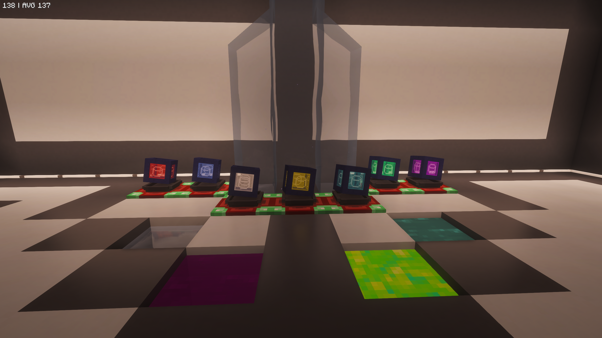

---
navigation:
  title: DampNull
  icon: deepnullreforged:damp_null_0
  position: 2
item_ids:
  - deepnullreforged:damp_null_0
  - deepnullreforged:damp_null_1
  - deepnullreforged:damp_null_2
  - deepnullreforged:damp_null_3
  - deepnullreforged:damp_null_4
  - deepnullreforged:damp_null_5
  - deepnullreforged:damp_null_6
---

# DampNull

The **DampNull** is the fluid-focused counterpart to the DeepNull.

Instead of storing items by slot, it stores fluids by tank.

## What a DampNull Does

- stores multiple fluids at once
- places source fluids into the world
- picks up source fluids directly from the world
- transfers fluids through compatible tanks and the docking station
- works with compatible modded fluids through NeoForge fluid handlers

## Tank Counts by Tier

| Tier | Tanks |
| --- | ---: |
| Redstone | 9 |
| Lapis | 9 |
| Iron | 9 |
| Gold | 18 |
| Diamond | 18 |
| Emerald | 18 |
| Creative | 18 |

## Tank Capacity by Tier

| Tier | Capacity Per Tank |
| --- | ---: |
| Redstone | 8,000 mB |
| Lapis | 16,000 mB |
| Iron | 32,000 mB |
| Gold | 64,000 mB |
| Diamond | 128,000 mB |
| Emerald | 256,000 mB |
| Creative | Infinite-style behavior |

## GUI Behavior

- left-click a tank to select it
- shift-click a tank to clear it
- hover tanks to see fluid details

Creative DampNull tanks intentionally display half-full while behaving effectively infinite.
