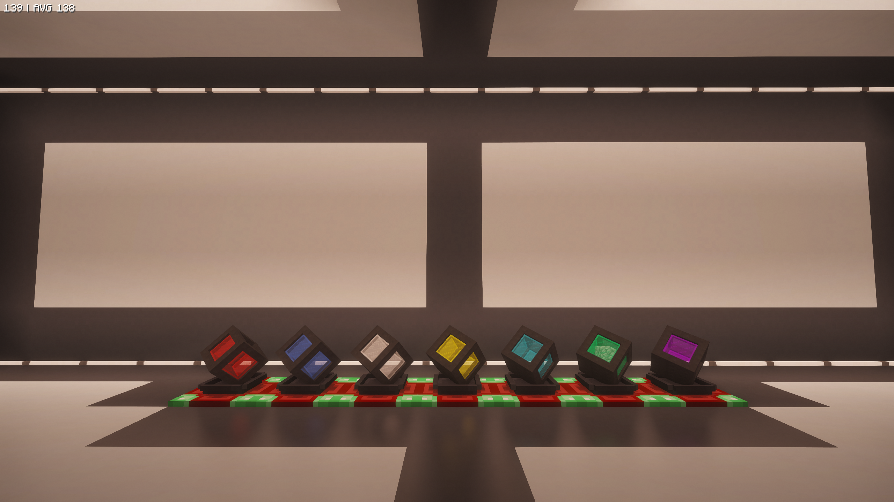

---
navigation:
  title: DeepNull and Tiers
  icon: deepnullreforged:deep_null_0
  position: 1
item_ids:
  - deepnullreforged:deep_null_0
  - deepnullreforged:deep_null_1
  - deepnullreforged:deep_null_2
  - deepnullreforged:deep_null_3
  - deepnullreforged:deep_null_4
  - deepnullreforged:deep_null_5
  - deepnullreforged:deep_null_6
---

# DeepNull and Tiers

A **DeepNull** stores items in dedicated internal slots. Each slot is bound to one item type at a time and can hold far more than a normal stack.

## What a DeepNull Does

- collects matching items automatically
- lets you directly place or use the selected stored item
- supports per-slot extraction and placement rules
- works in hand, in GUIs, and through the docking station

## Tier Progression

| Tier | Slots | Capacity Per Slot |
| --- | ---: | ---: |
| Redstone | 9 | 128 |
| Lapis | 18 | 512 |
| Iron | 27 | 1,152 |
| Gold | 36 | 2,048 |
| Diamond | 45 | 3,200 |
| Emerald | 54 | 2,147,483,647 |
| Creative | 54 | 2,147,483,647 |

## Direct Item Use

DeepNulls can directly use stored:

- blocks
- buckets and fluid containers
- food
- potions and drinkables
- many normal right-click items

## Slot Rules

Each slot supports:

- extraction rules
- placement rules
- tag matching
- manual selection
- reordering inside the GUI

## Creative Tier

Creative DeepNulls are intentionally special utility tiers with effectively infinite behavior and locking support.
